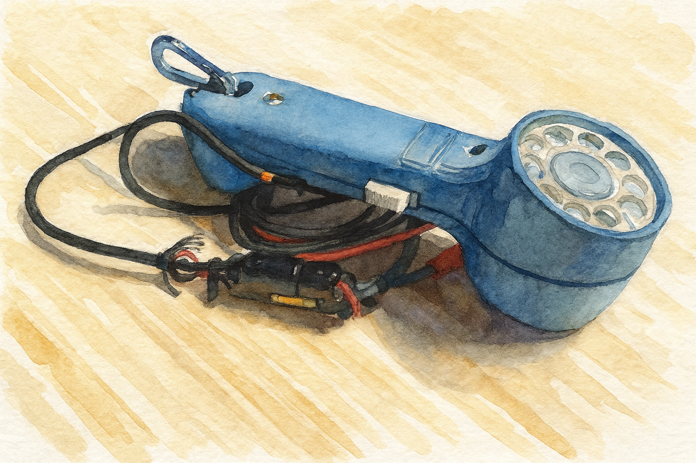

# RotaryFi

**RotaryFi** brings vintage telephony to the modern age — a Wi-Fi-enabled SIP
bridge that lets classic rotary phones and lineman’s sets make and receive VoIP
calls using an **ESP32** and a **Silvertel AG1171** analog line interface.

---

## Goal
Make a self-contained, Wi-Fi-enabled SIP endpoint that behaves like a
traditional analog line for legacy handsets.

---

## Core Components
| Component | Purpose |
|------------|----------|
| **ESP32** | MCU + Wi-Fi + SIP/RTP stack |
| **AG1171 (Silvertel)** | FXS module providing loop current, ringing, and line supervision |
| **I²S Codec** | Converts audio between ESP32 and AG1171 |
| **Rotary Lineman’s Set** | The star of the show – pulse dial & carbon mic classic |

---

## 🧩 Planned Features
- Loop current and ring generation via AG1171  
- Off-hook / on-hook detection  
- Pulse dial decoding → SIP digit mapping  
- SIP registration and call control (G.711 μ-law)  
- Local tone generation (dial, busy, ringback)  
- Sidetone and gain trimming for authentic sound  

---

## 🧰 Getting Started
1. Wire **AG1171** to the ESP32 via the codec interface.
2. Flash firmware with Wi-Fi credentials and SIP credentials.
3. Connect your vintage phone and go off-hook — dial tone awaits.

---

## ⚠️ Safety Note
The AG1171 generates high voltage (~90 V RMS) for ringing.  
Treat tip and ring as live lines even when powered from 5 V.

---

## 📅 Roadmap
- [ ] Hardware interface and local-echo
- [ ] Basic SIP registration  
- [ ] Pulse dial → SIP digit mapping  
- [ ] Ring cadence and ringback simulation  
- [ ] Web UI for config & debug

---

## 🧠 Inspiration
The main inspration of this was to [get my fathers line set](WesternElectric1013A_README.md) running again in some way. Built for fun, nostalgia, and a deep respect for the sound of a proper rotary click.

---

**License:** Creative Commons Attribution-NonCommercial 4.0 International (CC BY-NC 4.0)  
**Author:** Bill Church (2025)

## Acknowledgements

[BluePot](https://hackaday.io/project/166359-blue-pot/log/165359-a-fxs-with-a-slic-and-other-historical-things)