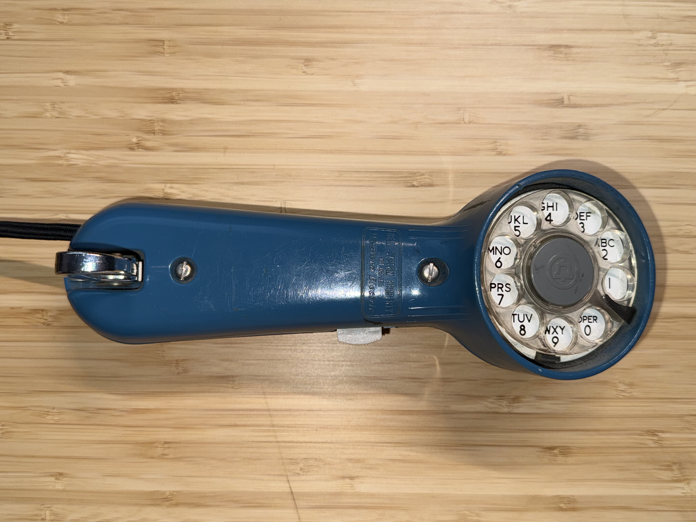
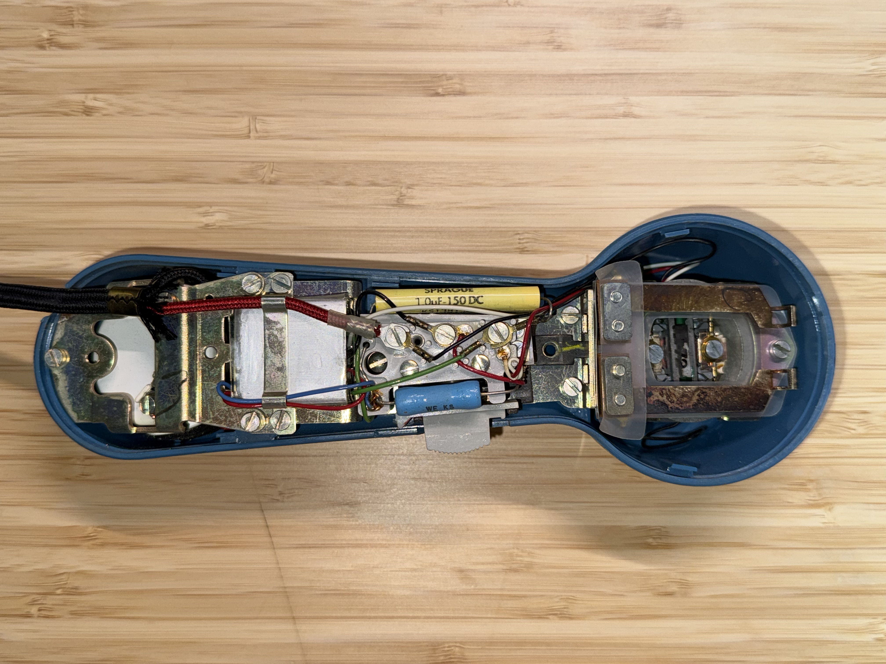
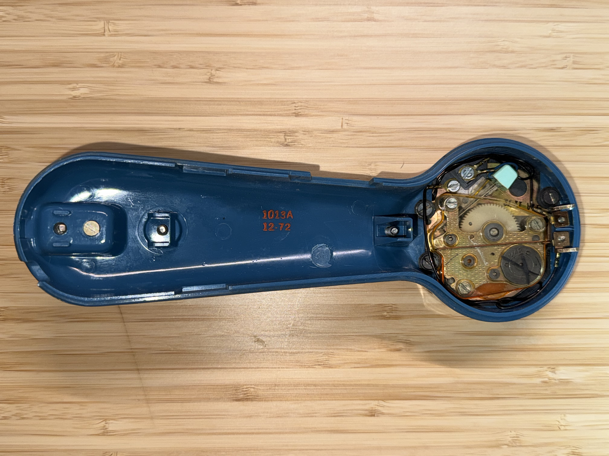
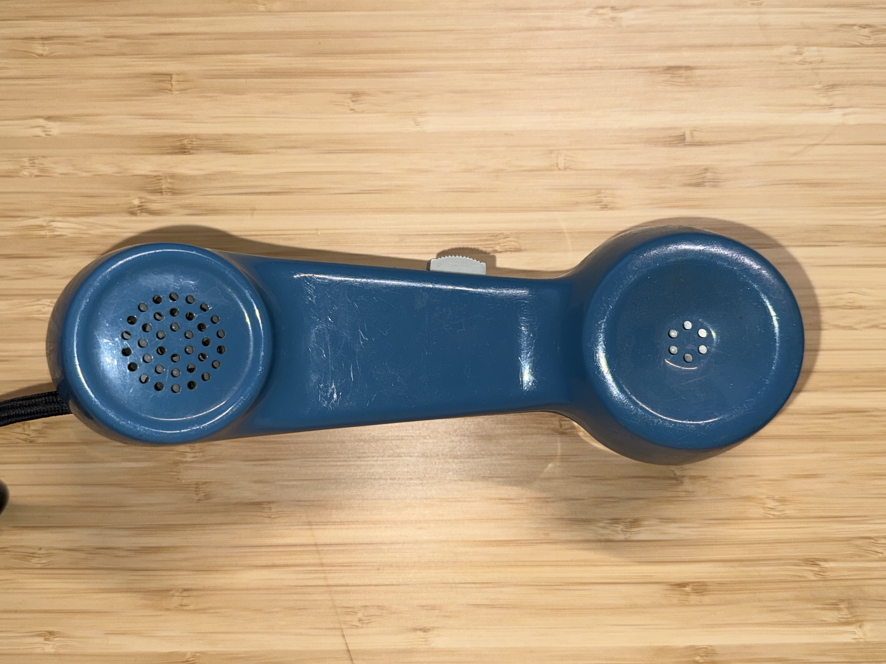
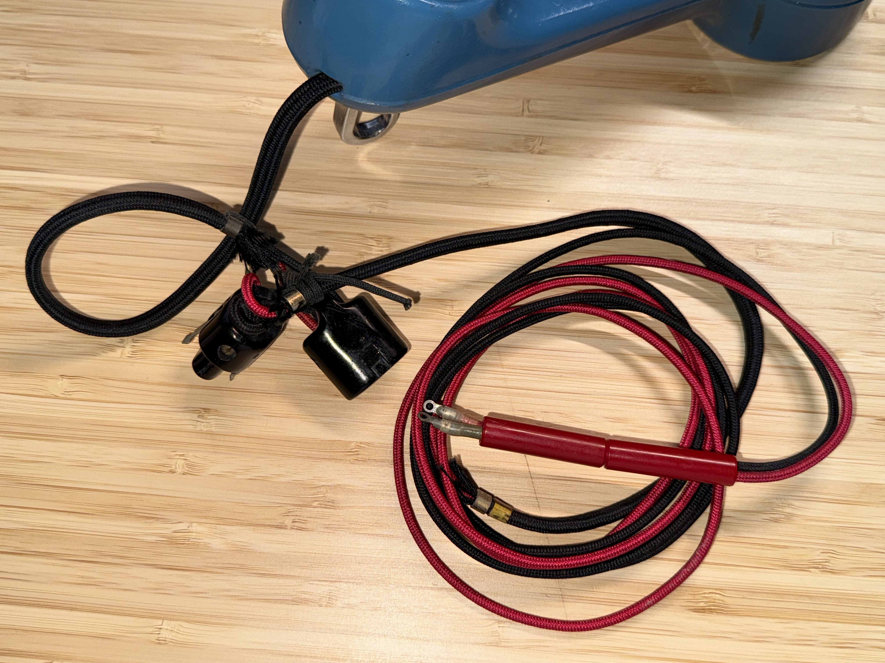

# Western Electric 1013A Lineman’s Test Set (“Butt Set”)

## Overview
The **Western Electric 1013A** is a rugged field test handset (commonly called a
“butt set” or lineman’s test set) used by Bell System / telephone company
technicians to access, test, and troubleshoot subscriber and trunk lines.
It combines a handset (microphone + earpiece), dialing capability, and switching
functions in a portable, durable shell.

My unit, with its “12‑72” marking, indicates manufacture in **December 1972**. This was my father's butt set which he used when he was a lineman for Southern Bell.

---

## Features & Construction
- Rotary dialing mechanism built into the handset
- Durable molded shell (ABS plastic?)
- Side slide switch for monitor and talk functions
- Clip for attaching to belt or cable
- Carbon microphone and magnetic receiver
- Rated for ~48V DC idle and 90V AC ring

---

## Historical Context & Significance

### The 1013 Series
Introduced in the early 1970s, the 1013A replaced the earlier 1011 series as
Western Electric’s standard rotary test handset for Bell System technicians.
The 1013A remained in use through the 1970s until DTMF and modular plug-based
models became more common.

### Role in the Bell System
These handsets were issued to field technicians for line installation,
maintenance, and troubleshooting. They allowed direct connection to the
telephone network for monitoring, dialing, and verifying service continuity.
All were marked **“Bell System Property”**, since telephone equipment was leased
rather than owned.

### Collectibility
Following the 1984 Bell System breakup, many 1013A sets were decommissioned.
Today they are prized by collectors and vintage telecom enthusiasts for their
rugged design and historical significance.

---

## References & Citations
- Nick vs Networking: [Western Electric 1013 Test Set (Butt Set)](https://nickvsnetworking.com/western-electric-1013-test-set-butt-set/)
- Bell System Practices (BSPs): Sections 103‑ and 104‑ for Lineman’s Test Equipment
- [Tek‑Tips Forum Discussion: “My New Buttset,” March 2008](https://www.tek-tips.com/threads/my-new-buttset.1408519/)
- Paul F: [Western Electric Handset Styles](http://www.paul-f.com/weHandsets.html)
---

## Summary
- **Model:** Western Electric 1013A
- **Date:** December 1972
- **Voltage:** 48 V DC nominal, 90 V AC ring
- **Use:** Analog telephone line test handset
- **Manufacturer:** Western Electric (for AT&T Bell System)

## Photos

 

 

 

